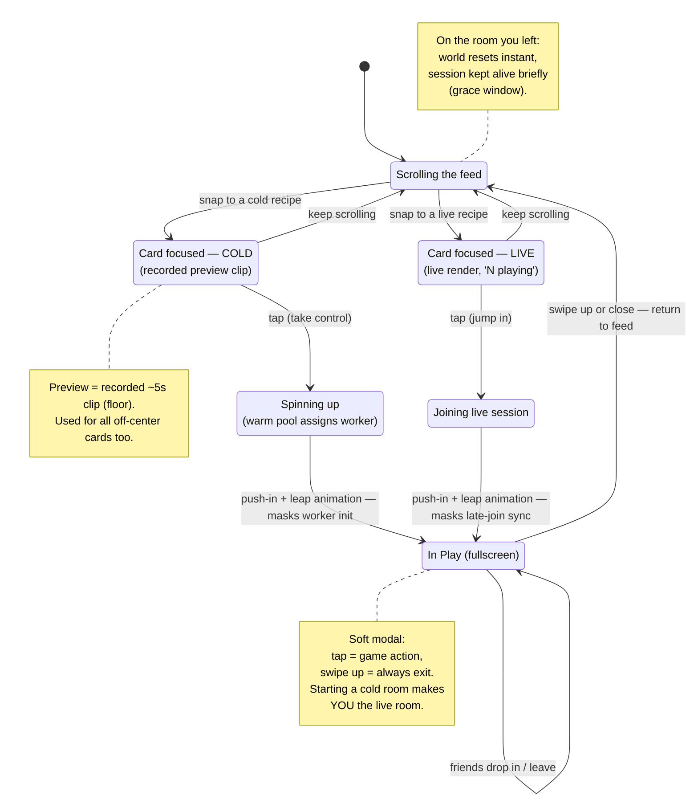
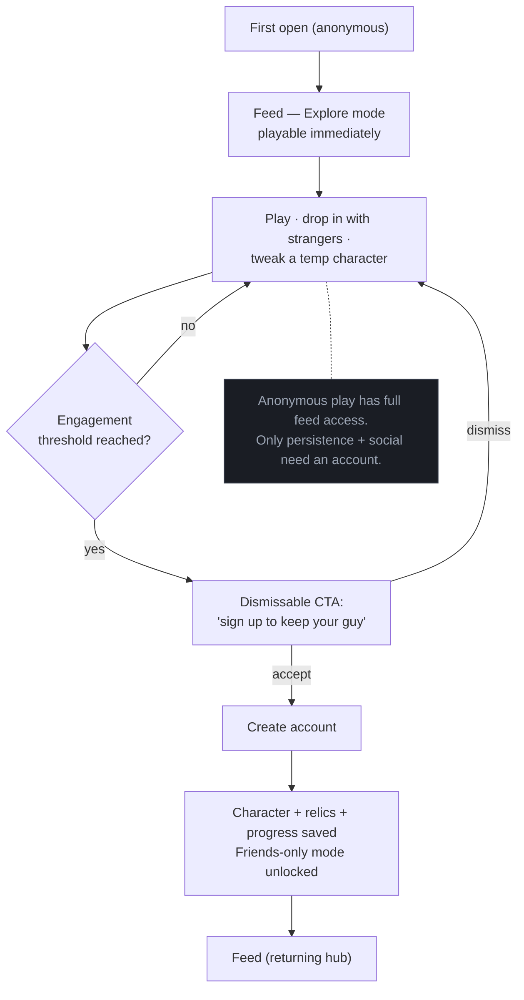

# Feed of Games — v1 Screen Flow

**Companion to:** architecture spec v0.3
**Scope:** v1 consumer experience only.

> **v1 scope decision.** v1 is **consume + play-with-friends + customize your character**. **User-authored games are v2** (deferred — and with it, the recipe-creation paradigm fork, Open Decision #5). v1's feed is filled by platform-minted + AI recipes (the §4.3 cold-start engine makes this viable with zero human authoring). Creation appears in these diagrams only as a greyed, dashed "v2" node so the fork stays visible without being designed yet.

This is the **screen-connection / state level**, intentionally above low-fi wireframes. Draw the arrows first: if every transition resolves cleanly, the foundation is solid enough to drop into layouts. Any arrow that feels undefined is a spec hole surfacing cheaply.

---

## 1. App screen map

The Feed is the hub. Everything else hangs off it. Nav chrome (bottom bar vs. gestures) is a wireframe-level choice — this shows screens and transitions, not the final navigation furniture.

```mermaid
flowchart TD
    Launch["App launch"] --> FirstRun{"First run<br/>or returning?"}
    FirstRun -->|first run| FeedX["Feed — Explore mode<br/>(anonymous, playable now)"]
    FirstRun -->|returning| Feed["Feed (home hub)<br/>vertical scroll of recipes"]
    FeedX --> Feed

    Feed -->|"tap a card"| Play["In-Game (play)<br/>see state machine §2"]
    Play -->|"swipe up = leap out"| Feed
    Play -. "after engagement threshold" .-> Signup["Signup CTA<br/>(dismissable) — 'keep your guy'"]

    Feed -->|nav| Friends["Friends / Social"]
    Feed -->|nav| Profile["Profile"]

    Profile --> Character["Character customization"]
    Profile --> Inventory["Inventory: Gear + Relics"]
    Profile --> Settings["Settings<br/>Explore &#8644; Friends-only"]

    Signup -->|accept| Auth["Create account"]
    Signup -. dismiss .-> Play
    Auth --> Feed
    Friends -.->|"requires account"| Auth

    Feed -. "v2" .-> Create["Create a Game<br/>(v2 — paradigm TBD)"]:::v2
    Profile -. "v2" .-> Create

    classDef v2 fill:#23262e,stroke:#7a8290,color:#9aa3b2,stroke-dasharray:5 5;
    classDef hub fill:#1d2330,stroke:#3b82f6,color:#e7ecf5;
    class Feed hub;
```

---

## 2. Card & play state machine (the heart)

This is the subtle part — the soft modal and the cold/live distinction. Every transition here is locked in spec §5, §8.3, and §9.

**Key reads:** there is no "enter game mode" tap — the first touch *is* the first action. Exit is always one swipe up, in any play state. A cold card you start promotes itself to live for the next person who scrolls to it.

---

## 3. First-run & signup

The drop-in magic happens *before* any account. The wall protects identity, not access — you can play and even customize a temporary character anonymously; signing up is what makes "your guy" persist.

---

## 4. Profile / identity IA

The data model here is locked (L3: appearance travels & is monetized; gear is local; relics are account-bound collectibles). Design the collection/flex views now; hold relic *interactions* loosely since fuel-use is v2.

```mermaid
flowchart TD
    Profile["Profile"] --> Char["Character customization"]
    Profile --> Inv["Inventory"]
    Profile --> Set["Settings"]

    Char --> Skins["Skins · hats · emotes"]
    Char --> Leap["Leap animation<br/>(seen on every transition)"]
    Skins --- Money["&#128176; monetized surface<br/>(always visible in 100% of games)"]:::money
    Leap --- Money

    Inv --> Gear["Gear (cosmetic loadout)<br/>local · poofs on exit"]
    Inv --> Relics["Relics — collection / flex<br/>account-bound · typed · v2 = fuel"]:::soft

    Set --> Toggle["Explore &#8644; Friends-only<br/>(also the moderation valve)"]
    Set --> AcctMgmt["Account · privacy"]

    classDef money fill:#1e2a1e,stroke:#4ade80,color:#bbf7d0;
    classDef soft fill:#23262e,stroke:#7a8290,color:#cbd5e1;
```

---

## What's deliberately not here

- **Recipe creation / authoring** — v2. Shown only as the dashed node in §1 so the fork stays visible.
- **Relic *spending* / fuel interactions** — v2; v1 shows collection only.
- **Scheduling / calendar invites** — v2 (spec §10).
- **Nav chrome, screen layouts, component design** — the next layer down (low-fi wireframes), once these arrows check out.

## Suggested next step

Walk every arrow above as if you were a first-time user, then a returning friend joining a live game. If a transition has no defined destination or feels ambiguous, that's the next spec hole to close — cheaper to catch as a missing arrow than as a half-built screen. When the flow holds end to end, start low-fi wireframes screen by screen, beginning with the **focused feed card** (cold and live variants), since that single screen carries the most novel UX weight in the whole app.
